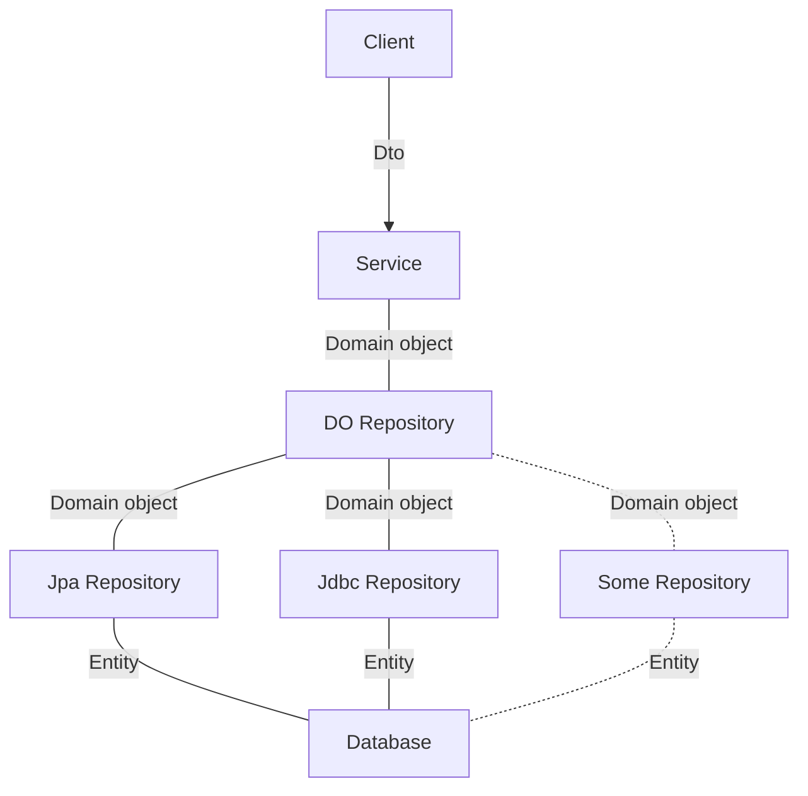

# Springboot template

SpringBoot 기반 서버 구현을 위한 템플릿입니다.


### Flow


### version catalog
### mongodb
### maxwell
- https://maxwells-daemon.io/quickstart/
- https://github.com/AlbertChanX/docker-mysql-maxwell-kafka
- maxwell 연결 테스트
  ```
  docker-compose up --build
  docker run -it --network spring_labs --rm zendesk/maxwell bin/maxwell --user=maxwell --password=maxwell --host=mysql --port=3306 --producer=stdout
  ```